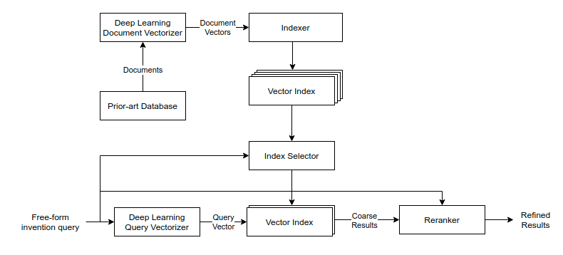

# PQAI: Patent Quality Artificial Intelligence

An AI-powered tool for running prior-art checks.

PQAI takes plain language invention description as input and finds similar prior work within patents and other technical literature. It uses a number of machine learning (ML) models to parse the input, find similar prior-art, and present the results. The ML models of PQAI have been trained on past patent examination records.



## Web-app

Use [search.projectpq.ai](https://search.projectpq.ai) to run prior-art searches.

## API Access

PQAI can be plugged into other apps easily through API integration. Refer to the [API Usage Guide](docs/README-API.md) for details.

## Deploy locally for testing or development

1. Clone the git repository and move into it

   ```bash
   git clone https://github.com/pqaidevteam/pqai.git
   cd pqai
   ```

2. Create a conda environment and install dependencies

   ```bash
   conda create --name pqai python=3.8
   conda activate pqai
   sudo apt-get update && apt-get install gcc g++ -y
   sudo apt-get install libgl1-mesa-glx libglib2.0-0 libsm6 libxrender1 libxext6 -y
   pip install -r requirements.txt
   ```

3. Download the models

   ```bash
   curl -o assets.zip "https://s3.amazonaws.com/pqai.s3/public/pqai-assets-latest.zip"
   unzip assets.zip -d models/
   rm assets.zip
   ```

4. Set up Mongo database for patent (bibliography) data

   ```bash
   curl -o mongodump.tar.gz "https://s3.amazonaws.com/pqai.s3/public/pqai-mongo-dump.tar.gz"
   tar -x --use-compress-program=pigz -f mongodump.tar.gz
   mongorestore
   ```

5. Download sample indexes (for testing)

   ```bash
   curl -o index.zip "https://s3.amazonaws.com/pqai.s3/public/sample-index.zip"
   unzip index.zip -d indexes/
   rm index.zip
   ```

6. Define environment variables in the included `env` file and rename it to `.env`

7. Run the server

   ```bash
   python server.py
   ```

## License

The project is open-source under the MIT license.

## Support

Please create an issue if you need help.

## Contribute

We welcome contributions. Please take a look at our [guidelines](./CONTRIBUTING.md) to understand how you can contribute to PQAI.

## Contact

Write to [sam@projectpq.ai](sam@projectpq.ai)
